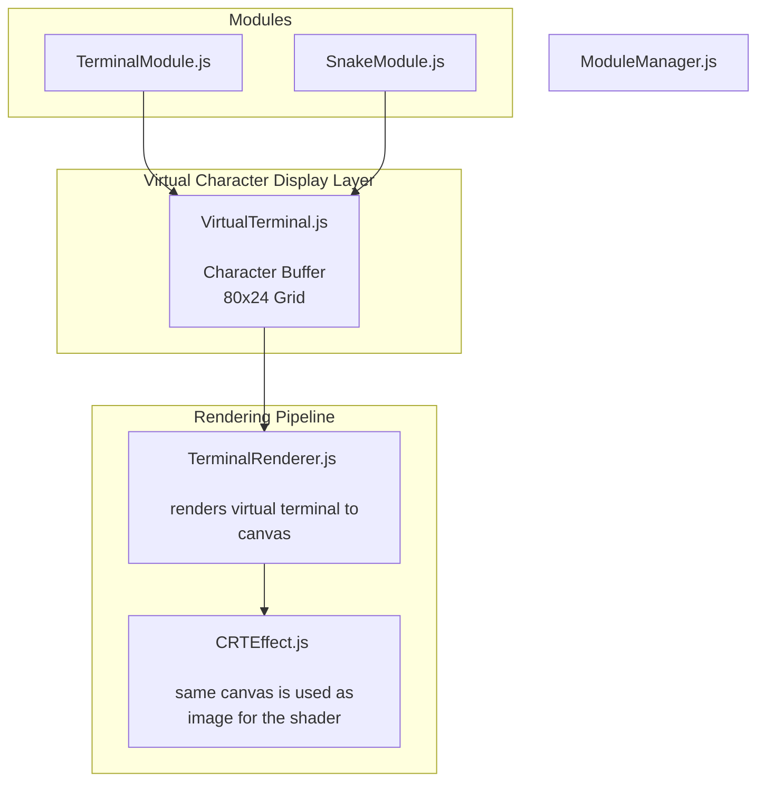

www.petripihla.com

# Terminal Website

A retro-style terminal website that simulates a CRT display effect with interactive commands and games.

## How it Works

The terminal operates through three main layers:

## Features

- Modular architecture for easy extension
- CRT shader effects
- Responsive design (desktop only)

