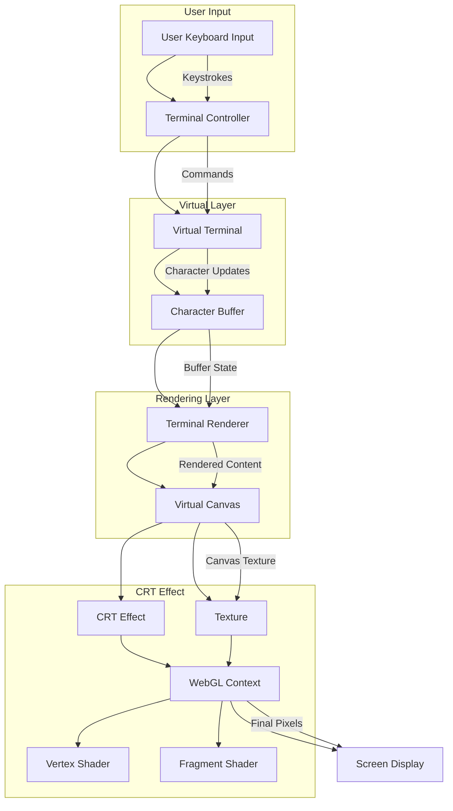

# Terminal Website

A retro-style terminal website that simulates a CRT display effect.

## How it Works

The terminal operates in three main steps:

1. **Virtual Terminal Buffer**
   - Maintains a 2D character array (80x24 characters)
   - Handles cursor position and text input
   - Manages command processing

2. **HTML Rendering**
   - The character buffer is rendered to HTML
   - Uses monospace font (JetBrains Mono) for consistent character width
   - Handles text input and cursor blinking

3. **CRT Effect**
   - HTML content is captured using html2canvas
   - WebGL shaders apply CRT effects:
     - Screen curvature
     - Scanlines
     - Green phosphor glow

## Project Structure

- `index.html` - Main entry point and terminal container
- `data/main.js` - Terminal buffer and input handling
- `data/commands.js` - Command definitions and banner
- `data/crt-effect.js` - WebGL shader implementation
- `data/cursor.js` - Cursor animation
- `data/style.css` - Basic styling

## Usage

Just open `index.html` in a modern browser. Type 'help' to see available commands.

Note: Requires WebGL support for CRT effects.



```mermaid
    graph TD
    subgraph Applications
        TC[Terminal Controller]
        SG[Snake Game]
    end

    subgraph Display Layer
        VT[Virtual Terminal]
        B[Character Buffer<br/>80x24 Grid]
    end

    subgraph Rendering Pipeline
        TR[Terminal Renderer]
        CRT[CRT Effect]
    end

    TC --> VT
    SG --> VT
    VT --> B
    B --> TR
    TR --> CRT

    %% Application only knows about Virtual Terminal
    TC -. "Only knows about" .-> VT
    SG -. "Only knows about" .-> VT
   ```